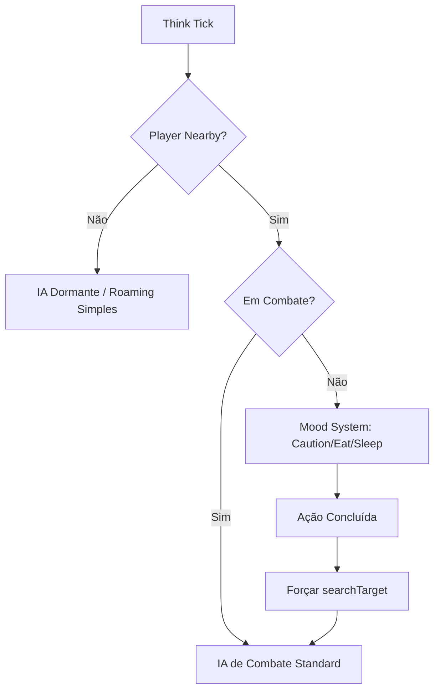

# Sistema de Visão e Alvos (Refatoração)

Este documento detalha a reformulação do sistema de detecção e seleção de alvos dos monstros selvagens, focando em realismo, performance e correção de bias.

## 1. Melhorias de IA e Seleção de Alvos

### 1.1 Remoção do Bias de Jogador
Anteriormente, o sistema de IA selvagem priorizava jogadores agressivamente, ignorando summons em diversas situações.
- **Mudança:** A lógica de targeting em Lua foi neutralizada para permitir que o motor C++ (`searchTarget`) gerencie a lista de alvos de forma natural.
- **Resultado:** Monstros agora atacam Summons e Jogadores com base na distância e ameaça real, não apenas por serem "Players".

### 1.2 Otimização de Performance (Spectator Check)
Para evitar processamento desnecessário em monstros distantes de qualquer jogador:
- **Lógica:** A função `checkMood` agora realiza um `spectator check` antes de executar qualquer lógica complexa.
- **Resultado:** IA de "Moods" (Caution, Sleep, Eat) só é ativada se houver pelo menos um jogador em um raio de 10x10. Isso reduz drasticamente o log do servidor e o consumo de CPU em áreas desertas.

### 1.3 Retomada de Alvo (Re-engagement)
Após estados de inatividade (Comer ou Dormir), o monstro precisa "acordar" para o combate.
- **Lógica:** Ao terminar de comer ou acordar, o monstro executa um `c:searchTarget()` forçado.
- **Resultado:** Elimina o bug onde o monstro ficava "congelado" ou ignorava o inimigo parado na frente dele após terminar uma atividade de Mood.

---

## 2. Visão Direcional (Implementação)

O sistema de radar 9x9 omnidirecional foi substituído por uma percepção baseada em direção (Cone de Visão).

### 2.1 Regras de Visão
- **Frente (Cone ~100°):** Detecção padrão e imediata.
- **Laterais (Periférica):** Detecção com chance reduzida/atrasada (preparação para sistema de ruído).
- **Costas:** O monstro é "cego" para criaturas atrás dele, a menos que seja atacado ou que a criatura faça barulho (próxima implementação).

### 2.2 Dependência de Direção
A detecção agora utiliza a propriedade `direction` do monstro (NORTH, SOUTH, EAST, WEST) para calcular o produto escalar entre o vetor de visão e a posição do alvo potencial.

---

## 3. Fluxo de Decisão da IA

Este sistema garante que os monstros se comportem de forma orgânica, reagindo ao ambiente ao invés de apenas "saberem" onde o jogador está o tempo todo.